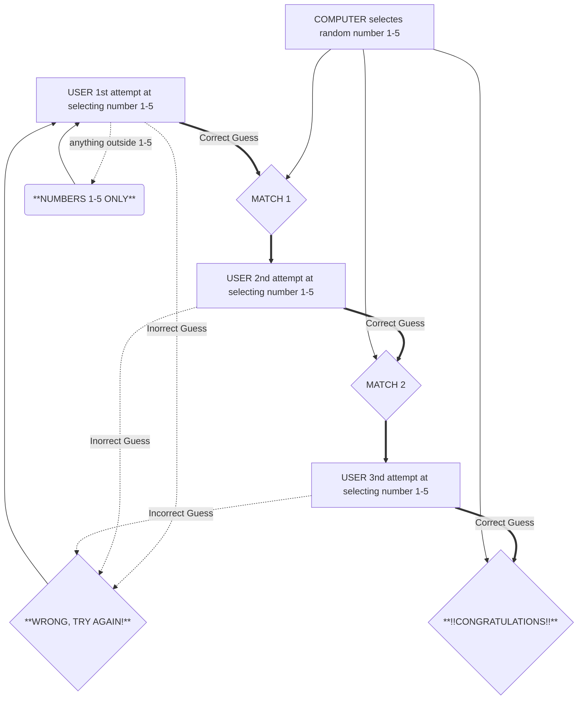

# Guessing Game
 In this game, the computer will randomly select a number from one to five.
 The person will try to guess the number the computer randomly selected.
## ONLY numbers between one and five will be accepted.
 If the user enters anything outside of the numbers one through five, they will be prompted:
## NUMBERS 1-5 ONLY
 Then the user will be redirected back to try to guess the number.
 If the user gets the number wrong, they will be prompted:
## WRONG, TRY AGAIN!
 The process will continue until the computer guesses the number correct three times in a row.
 Once the copmuter successfully guesses the numer three times in a row, a message pops up saying
## !!CONGRATULATIONS!!

